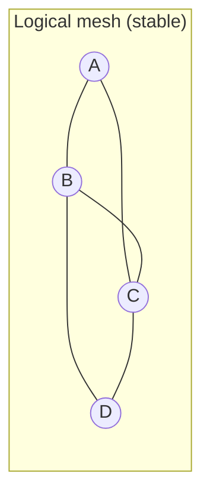
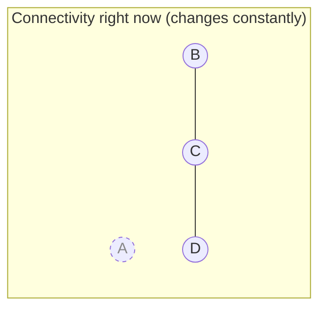
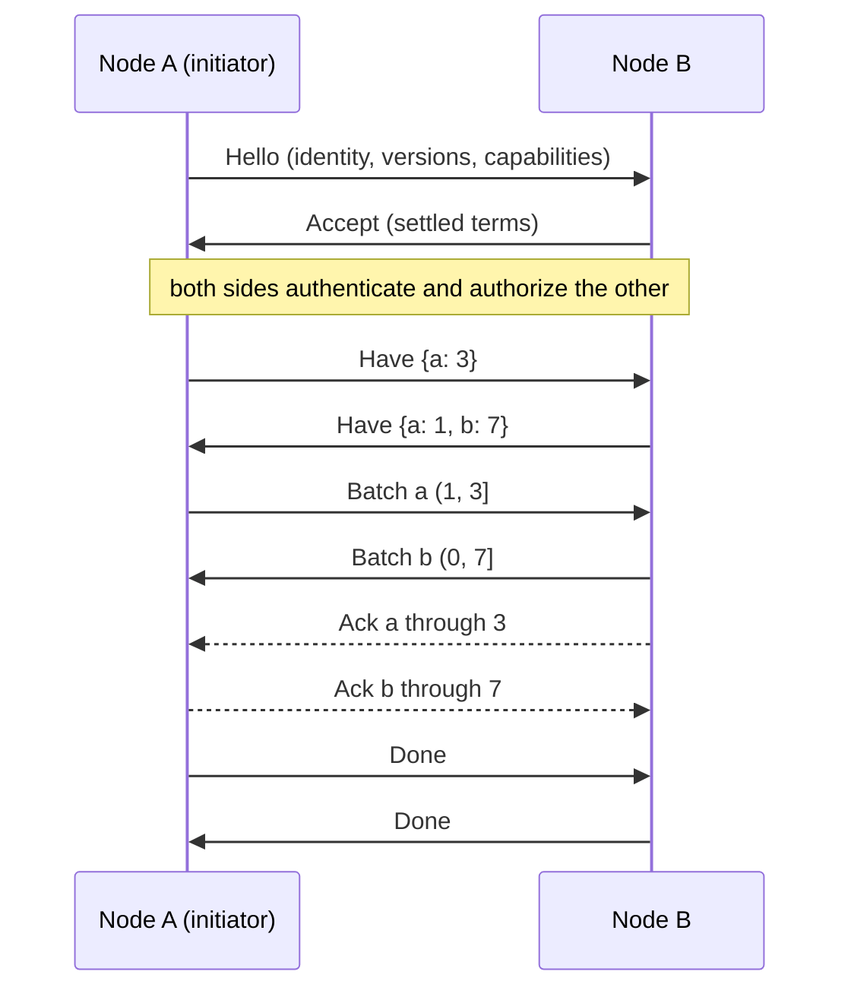
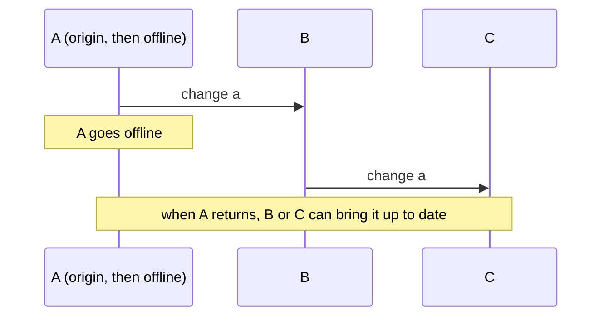

<p align="center">
  
</p>

<h1 align="center">dbmesh</h1>

<p align="center"><strong>A persistent, decentralized synchronization mesh for application-owned database state.</strong></p>

<p align="center">
  <a href="https://github.com/noirbizarre/dbmesh/actions/workflows/ci.yaml">
    
  </a>
  <a href="https://codecov.io/gh/noirbizarre/dbmesh">
    
  </a>
  <a href="https://crates.io/crates/dbmesh">
    
  </a>
  
  <a href="https://noirbizarre.github.io/dbmesh/">
    
  </a>
  
</p>

---

DBMesh keeps the databases of many application instances converging, without a server in the middle and without
assuming anyone is online. It is a **library you embed**: each instance of your application becomes a node of a
persistent mesh, keeps accepting writes while offline, and catches up from whichever peer it reaches next.

> **Status: bootstrap.** The architecture, the protocol and a minimal in-process synchronization path exist and are
> tested. There is no production transport and no live SurrealDB adapter yet. See [Status](#status).

## Why

Applications that own their data on several devices (a laptop, a phone, a home server) need those copies to agree.
Existing answers fit badly:

- A **database cluster** keeps one logical database consistent across machines that are always connected and
  mutually trusting. It does not survive a laptop on a train.
- **Primary/replica replication** has a single writer and a hierarchy. Every device here writes.
- A **hosted sync service** is a central dependency that owns your topology.

DBMesh synchronizes *selected, application-owned state* between peers that come and go, and leaves every decision
that depends on your data (what to share, whom to trust, how to merge) to your application.

## What "mesh" means

The mesh is **logical**: the set of nodes that share state. It is not the set of open sockets.





Three questions are kept apart on purpose, because conflating them is how mesh designs go wrong:

| Question | In DBMesh |
|---|---|
| Who is in the mesh? | membership: the peers a node knows, reachable or not |
| How do I learn about peers? | discovery: static configuration today, pluggable later |
| Who can I reach now? | connectivity: a transport concern, never a protocol assumption |

## Persistent versus connected

Nothing in DBMesh depends on a connection staying open. A session is short-lived and disposable; **all progress lives
in durable cursors**. If a session dies (connection lost, process killed, peer gone) the next one resumes from what
each side durably holds, not from anything either side remembers about the previous session.



`Have` is the whole negotiation: "I have processed origin `laptop` through sequence 18427" tells the other side
exactly what to send, and nothing else. The sender keeps no per-peer session state to lose.

## Offline and intermittent nodes

A node writes to its own database as it always did. DBMesh *captures* those transactions into a durable log with a
per-origin sequence number. When any peer is reachable, a session sends whatever that peer is missing. A node that
was offline for a month and a node that was offline for a second take the same path.

If a peer is further behind than the log reaches (history was discarded), the session ends with an explicit
`SnapshotRequired` outcome rather than a silent gap. Snapshots themselves are future work.

## Selective synchronization and per-peer policy

Nothing is synchronized unless the application says so. The default policy allows nothing.

```text
memories, entities, relations, embeddings  -> sync
migrations, local_cache, sync_metadata     -> never
```

A policy answers *per peer, per direction, per mutation*, so different peers can receive different data:

```text
Laptop  -> Server   memories, entities, relations
Phone   -> Server   memories only
Desktop -> Laptop   memories, embeddings
```

It is evaluated **before** a change is sent and **again before** a received change is applied: a peer cannot push
data your application never agreed to take. Cursors still move past filtered content, so filtering never stalls
synchronization. The interface takes the whole mutation, which keeps record-level and field-level rules possible
without redesigning anything.

## Change propagation

Changes are relayed. A node that received a change from one peer can hand it to another; the origin, the immediate
sender and the distance travelled stay distinct.



Cursors are per *origin*, so a change is never delivered twice to the same node however many paths lead to it. A
node that holds only part of a transaction (policy trimmed it) refuses to relay it as if it were whole.

## Transactions

A transaction is the unit of capture, transfer and application. A sequence number names a whole committed
transaction, a batch carries whole transactions, and a remote transaction is applied atomically:

```sql
BEGIN TRANSACTION;
CREATE memory:foo;
CREATE entity:bar;
RELATE memory:foo->mentions->entity:bar;
COMMIT;
```

A peer never observes `memory:foo` without `entity:bar`. A cursor can never point into the middle of a transaction,
so a retry cannot produce a partially duplicated one.

## Checkpoints and resume

- A receiver writes a transaction to its log **before** applying it, and advances its cursor **after**.
- A crash in between is finished by `start()` on restart, and replay is harmless because applying is idempotent.
- The sender persists a checkpoint only when the peer acknowledges a batch.
- Duplicate delivery changes nothing; a gap is refused and the session retried from the cursor.

## Conflicts

DBMesh does not start with CRDTs and does not impose last-write-wins. The database adapter *reports* that a remote
change does not fit the local state; your `ConflictResolver` decides: accept local, accept remote, merge, or reject
the whole transaction. The default refuses, because that loses no local data and invents no semantics.

## Transport abstraction

A transport moves opaque, message-framed bytes and nothing else. It knows nothing about sessions or changes, so
HTTP, WebSocket, QUIC, Unix sockets, a LAN protocol or something application-specific can all be added without
touching the engine, and a node may use a different one per peer. Only an in-process test transport exists today.

## Security boundaries

DBMesh asks, the host answers. It defines hooks and ships no identity system or PKI:

| Hook | Question |
|---|---|
| `Authenticator` | Is the node on the other end who it claims to be? |
| `Authorizer` | What may this peer do (which protocol capabilities)? |
| `SyncPolicy` | Which data may flow to or from this peer? |
| Transport | Is the channel encrypted and the peer proven? Reported as `TransportCapability` |

The defaults trust nobody and share nothing. A peer that is discovered is not thereby trusted.

## SurrealDB integration

SurrealDB is the first intended backend, kept behind the adapter boundary: the core, the protocol and the engine
never see a SurrealDB type. The adapter contract is *capture* (ordered, whole transactions) and *apply* (atomic,
idempotent, no echo). The `surrealdb` feature currently provides the pure mapping (record identity, versionstamps,
changefeed statements). The live adapter is tracked in the issue tracker.

## Mesh versus federation

DBMesh **copies selected state so that replicas converge**. Federation **queries state that stays owned by someone
else**. They solve different problems and DBMesh stays independent of federation.

## Embedding DBMesh

```rust
use dbmesh::core::{Collection, StaticPolicy};
use dbmesh::DbMesh;

let mesh = DbMesh::builder(database, store)
    .policy(
        StaticPolicy::new()
            .exchange(server.clone(), [Collection::new("memories")?])
            .never([Collection::new("migrations")?]),
    )
    .security(my_trust)        // your Authenticator + Authorizer
    .resolver(my_resolver)     // your ConflictResolver
    .build()
    .await?;

// Finish interrupted work and record local changes.
mesh.start().await?;

// Whenever your application decides to, over a transport it chooses:
let report = mesh.sync_with(&transport, &server).await?;

// For every connection your transport accepts:
mesh.serve(connection).await?;
```

DBMesh owns no thread and no socket: *when* to synchronize and *how* peers are reached is yours. A CLI is not
required, and never owns the synchronization lifecycle.

## Status

| Works and is tested | Not yet |
|---|---|
| Domain model, versioned protocol, session state machine | A production transport (WebSocket, QUIC, ...) |
| Resume, replay, relay, per-peer policy, conflict boundary | A live SurrealDB adapter |
| In-memory store and database for tests | A durable on-disk metadata store |
| Two-node and three-node synchronization in-process | A background supervisor with retry and backoff |
| | Snapshots for peers behind the retained log |

## Documentation

<https://noirbizarre.github.io/dbmesh/>: start with the
[architecture](docs/architecture.md) and the [decision records](docs/adr/README.md).

## Contributing

See [CONTRIBUTING.md](CONTRIBUTING.md).

## License

MIT — see [LICENSE](LICENSE).
