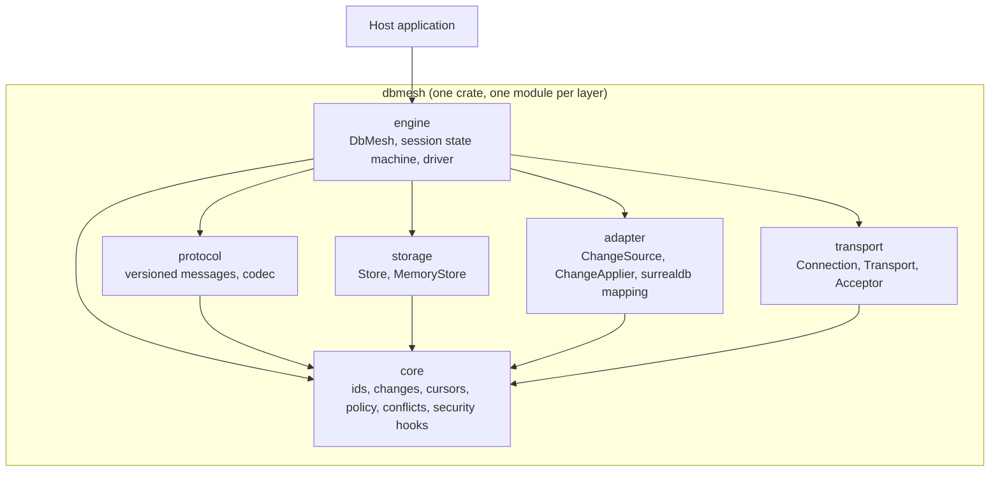
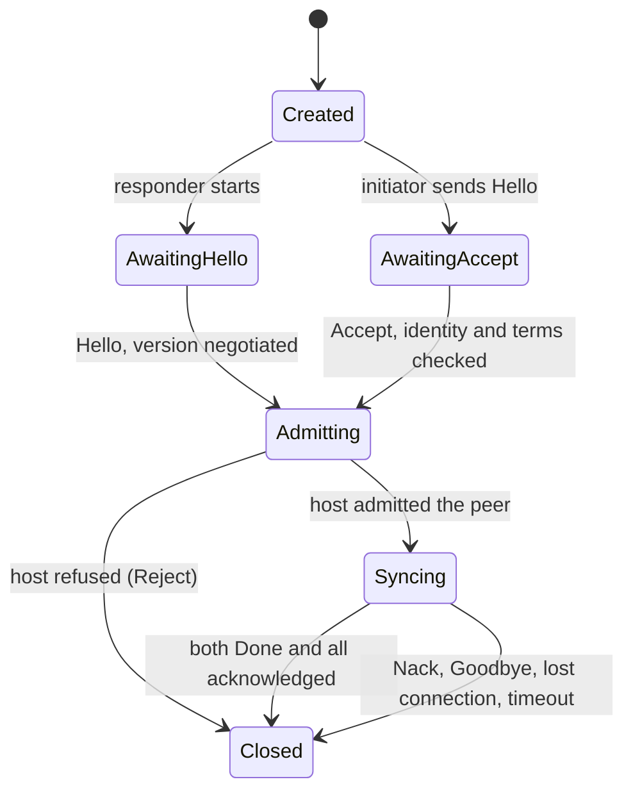

# Architecture

DBMesh is an embedded, library-first synchronization engine. This document describes its boundaries, the invariants
those boundaries protect, and what happens when things go wrong. The reasons behind individual choices live in the
[decision records](adr/README.md).

## Layers

The engine is the only layer that knows about all the others. Everything else depends on `core` and on nothing else,
which is what allows any layer to become its own crate later without untangling anything. This is checked by
`tests/layering.rs`, not left as a convention.

| Layer | Responsibility | Must not know about |
|---|---|---|
| `core` | Domain types and the boundaries the host owns: policy, conflict resolution, trust | every other layer |
| `protocol` | Messages, versions, the wire encoding | transports, storage, adapters, the engine |
| `transport` | Moving opaque message-framed bytes | the protocol, sessions, changes |
| `storage` | Durable DBMesh state: identity, peers, cursors, the log | the engine, adapters, the protocol |
| `adapter` | Capturing local transactions, applying remote ones | the engine, storage, the protocol |
| `engine` | Running sessions, capture, recovery | nothing: it composes the rest |

The crate stays a single crate on purpose. The module tree is the boundary; promoting a module to a crate is a
mechanical step the day a second consumer or a heavy dependency (the SurrealDB SDK) justifies it.

## Concepts

### Origin, sender, receiver, path

Four words that are easy to blur and must not be:

- **Origin**: the node that first committed a change. Immutable as the change travels.
- **Sender**: the peer that handed it to this node. It differs from the origin whenever a change is relayed.
- **Receiver**: this node.
- **Path**: how far it travelled. Recorded as a hop count and the immediate sender in `Provenance`; the full chain is
  reconstructible by following each node's log. Cursors, not the path, guarantee correctness.

### Sequences, cursors, the log

Each origin numbers its committed transactions `1, 2, 3, ...` with no gaps. A node's durable state is, for every
origin it has seen, the highest sequence it has **processed** (applied, or deliberately skipped by policy): a
`CursorSet`, i.e. a version vector. The `Have` message is exactly that set.

The **log** holds one entry per sequence per origin, local and received alike. It is what lets a node relay history it
did not author. An entry may hold no content (policy dropped the whole transaction) or a *partial* transaction
(policy trimmed it); such an entry is never relayed, because forwarding it would let the next node believe it saw
everything.

### The session

A session is a pure state machine, `engine::session::Session`. It consumes `Input`s and emits `Action`s; the async
driver performs the actions (send, read the log, apply to the database, authenticate) and feeds the results back.

In `Syncing`, each direction is stop-and-wait: one batch in flight, acknowledged before the next. The session
completes when both sides have sent `Done` and nothing is unacknowledged. A session holds no state that matters after
it ends.

## Invariants

Each invariant names the test that enforces it. If you change code covered by one, that test is your contract.

| # | Invariant | Enforced by |
|---|---|---|
| 1 | A sequence names a whole committed transaction; sequences per origin are gapless from 1. | `storage::memory::tests::local_sequences_are_assigned_without_gaps_starting_at_one`, `a_read_stops_at_the_first_hole_in_the_log` |
| 2 | A cursor never moves backwards, so replaying an old acknowledgement is harmless. | `core::sequence::tests::a_cursor_never_moves_backwards` |
| 3 | A transaction is applied whole or not at all, locally and remotely. | `adapter::memory::tests::a_transaction_is_applied_whole_or_not_at_all`, `two_node_sync::by_default_a_conflicting_transaction_is_refused_whole_and_not_retried` |
| 4 | Write-ahead: a received transaction is logged before it is applied; the cursor moves after. A crash in between is finished on restart. | `two_node_sync::a_crash_between_logging_and_applying_is_recovered_without_duplicates` |
| 5 | Duplicate delivery changes nothing. | `idempotent_replay::a_batch_delivered_twice_is_applied_once_and_acknowledged_both_times`, `adapter::memory::tests::applying_a_transaction_twice_is_recognized_as_a_replay` |
| 6 | Progress is explicit and durable: a session resumes from cursors, never from remembered session state. | `engine::session::tests::a_resumed_session_asks_only_for_what_the_peer_is_missing`, `two_node_sync::a_session_cut_mid_transfer_resumes_from_what_the_peer_durably_holds` |
| 7 | The sender persists a checkpoint only after the peer acknowledges. | `engine::session::tests::a_sent_batch_is_recorded_only_once_the_peer_acknowledges_it`, `two_node_sync::a_local_transaction_reaches_the_peer_atomically_and_the_sender_persists_a_checkpoint` |
| 8 | Nobody can rewrite a node's own history. | `engine::session::tests::no_peer_can_rewrite_this_nodes_own_history` |
| 9 | Nothing is synchronized or trusted by default. | `core::policy::tests::the_default_policy_allows_nothing`, `core::security::tests::the_default_security_denies_everyone` |
| 10 | Policy is evaluated before sending and again before applying. | `two_node_sync::each_peer_receives_only_the_collections_it_was_granted`, `a_receiver_applies_its_own_policy_even_when_the_sender_sends_more` |
| 11 | A node never relays content it holds only in part. | `two_node_sync::a_node_that_only_holds_part_of_a_transaction_does_not_relay_it` |
| 12 | Relaying requires the negotiated `relay` capability. | `engine::session::tests::without_the_relay_capability_only_first_hand_history_is_served`, `relayed_history_is_refused_when_relaying_was_not_agreed` |
| 13 | Unknown message types are answered with an explicit `Unsupported`, never a crash or silence. | `protocol::codec::tests::a_message_type_from_the_future_is_unsupported_not_malformed`, `engine::session::tests::a_message_type_from_the_future_is_answered_with_an_explicit_unsupported` |
| 14 | The wire format is a public contract. | `tests/protocol_wire.rs` |
| 15 | Layers depend only in the permitted directions; SurrealDB appears only in its adapter module. | `tests/layering.rs` |
| 16 | The session state machine performs no I/O and reads no clock. | `tests/layering.rs::the_session_state_machine_performs_no_io_and_reads_no_clock` |
| 17 | Diagnostic codes follow `dbmesh::<module>::<kind>` and every diagnostic says what to do. | `error::tests::every_diagnostic_code_follows_the_published_scheme_and_carries_advice` |
| 18 | A refused or unauthorized peer receives no data. | `two_node_sync::a_peer_the_host_does_not_trust_is_refused_and_receives_nothing` |

## Failure model

| Failure | Semantics | State |
|---|---|---|
| Peer unavailable | `sync_with` returns `Error::Transport`; the peer's status becomes `Failed`. Local writes continue and are captured. | implemented |
| Connection lost mid-session | Outcome `ConnectionLost`. The next session resumes from durable cursors. | implemented |
| Process crash | `start()` finishes logged-but-unapplied transactions; apply is idempotent by contract. | implemented |
| Duplicate delivery | Recognized by cursor and by the adapter; acknowledged again, applied once. | implemented |
| Out-of-order delivery | A batch that starts beyond the held cursor is refused (`Nack` `gap`) and the session ends; it retries from the cursor. | implemented |
| Partially received batch | Nothing is applied until a batch is complete; the sender repeats it next session. | implemented |
| Partially applied batch | Progress is recorded per transaction, so the next session resumes after the last applied one. | implemented |
| Long offline period | Same path as a short one while the log retains the history. | implemented |
| Stale peer (behind the log) | Outcome `SnapshotRequired`; no silent gap. Producing snapshots is future work. | detected, not resolved |
| Incompatible protocol version | `Reject` `incompatible_version`, nothing transferred. | implemented |
| Unsupported capability | `Reject` `unsupported_capability` if required; an optional one narrows the session. | implemented |
| Unsupported message | `Unsupported` is sent, session ends. | implemented |
| Conflicting writes | Adapter reports, host `ConflictResolver` decides; default rejects the whole transaction. | boundary implemented |

Known limits of the bootstrap, stated rather than hidden:

- **Conflict detection** in the reference adapter is an optimistic base-revision check. It does not track causality,
  so it can report conflicts a version-vector scheme would not, and replicas can stay diverged after an
  `AcceptLocal` or `Reject` until the application writes again.
- **Sequence reset** after restoring a node from an old backup would reuse sequence numbers. Guarding against it
  (an origin epoch) is future work.
- **Stop-and-wait** batching favours obviousness over throughput.

## Template divergences

The repository is generated from [rust.tpl](https://github.com/noirbizarre/rust.tpl) with `kind = library`,
`publish = true` and `docs = true`. Everything below the `# --- project-specific ---` markers is ours; nothing
template-owned was edited. The additions are:

- `Cargo.toml`: dependency `uuid`; dev-dependency `tokio` (tests only: the library is runtime-agnostic); feature
  `surrealdb`.
- `src/`: the module tree above, in place of the template's placeholder `run()`.
- `docs/`: this document and the ADRs, in the template's `docs/adr/` convention.
